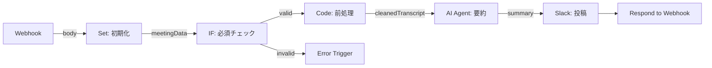
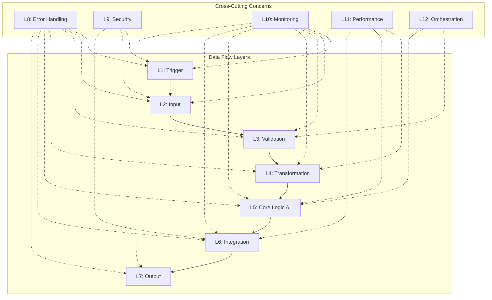

# 目的

Step010の業務要件とStep020のAI設定を、12層アーキテクチャフレームワークを用いてn8n技術要件に変換し、技術要件書を作成する。

# 背景

v4.0では、データフロー層（7層）と横断的関心事層（5層）を統合した12層アーキテクチャを採用。業務要件を技術的に実装可能な形に変換し、各層に適切なn8nノードをマッピングすることで、設計品質を向上させる。

# 言葉の定義

- **12層アーキテクチャ**: データフロー層（L1-L7）+ 横断的関心事層（L8-L12）の統合フレームワーク
- **データフロー層**: Trigger → Input → Validation → Transformation → Core Logic → Integration → Output の7層
- **横断的関心事層**: Error Handling、Security、Monitoring、Performance、Orchestration の5層
- **Layer 1 (Trigger)**: イベント検知・受信層（Webhook、Schedule Trigger、Email Trigger）
- **Layer 2 (Input)**: データ受信・初期化層（HTTP Request、Google Sheets、Database）
- **Layer 3 (Validation)**: 入力検証・フォーマット確認層（IF、Switch、Code）
- **Layer 4 (Transformation)**: データ変換・加工層（Edit Fields、Date & Time、Code）
- **Layer 5 (Core Logic)**: AI判断・ビジネスロジック層（AI Agent、Function、Code）
- **Layer 6 (Integration)**: 外部連携・API呼び出し層（HTTP Request、Slack、Gmail）
- **Layer 7 (Output)**: 結果出力・通知層（Set、Respond to Webhook、Database）
- **Layer 8 (Error Handling)**: エラー検知・リカバリ層（Error Trigger、IF、Retry）
- **Layer 9 (Security)**: 認証・認可・暗号化層（Credentials、HTTP Auth、Crypto）
- **Layer 10 (Monitoring)**: ログ出力・メトリクス収集層（Sticky Note、Set、HTTP Request）
- **Layer 11 (Performance)**: キャッシュ・並列処理層（Wait、Split In Batches、Loop Over Items）
- **Layer 12 (Orchestration)**: フロー制御・条件分岐層（IF、Switch、Merge、Wait）

# 制約

- 出力制約: 技術要件書を出力後、ユーザーに確認を求め、承認後にStep040へ進む
- 12層完全マッピング必須: 業務要件のすべての要素を12層のいずれかにマッピングすること
- n8nノード選定必須: 各層に適切なn8nノードタイプを割り当てること
- n8n-MCP活用必須: ノード選定時にn8n-MCPサーバーを使用して最新情報を取得すること
- データフロー明確化必須: 入力→処理→出力のデータフローを明示すること
- 横断的関心事統合必須: エラー処理、セキュリティ、監視を各層に適切に配置すること
- 出力ディレクトリ: `./{業務目的}/step030_技術要件変換/` に成果物を格納すること

# 処理手順

## 処理手順の全体フロー

```
開始（Step010業務理解書 + Step020 AI設定書）
  ↓
1. 業務要件の層別分解
  ↓
2. データフロー層マッピング（L1-L7）
  ↓
3. 横断的関心事層マッピング（L8-L12）
  ↓
4. n8nノード選定（n8n-MCP活用）
  ↓
5. データフロー設計
  ↓
6. 技術要件書の作成
  ↓
完了（Step040へ）
```

## 処理手順1: 業務要件の層別分解

- 目的: Step010の業務要件を12層の観点で分解する
- 背景: 業務要件を技術層にマッピングする準備
- エージェント名: システムアーキテクト（グレディ・ブーチ『オブジェクト指向分析設計』）
- 役割: 業務要件を技術的な観点で分類する
- 責務: 業務要件の層別分類表の作成
- 処理詳細手順:
  1. Step010の業務要件を確認
  2. 各要件を12層のいずれかに分類:
     - トリガー条件 → L1
     - データ受信 → L2
     - 入力検証 → L3
     - データ変換 → L4
     - AI処理 → L5
     - 外部連携 → L6
     - 結果出力 → L7
     - エラー処理 → L8
     - セキュリティ → L9
     - ログ・監視 → L10
     - パフォーマンス最適化 → L11
     - フロー制御 → L12
  3. 分類結果を表形式で整理
- 評価・判断基準:
  - すべての業務要件が12層のいずれかに分類されていること
  - 分類に矛盾がないこと
- 出力テンプレート:
```markdown
### 業務要件の層別分解

| 層 | 業務要件（Step010より） | 該当要素 |
|----|------------------------|---------|
| L1: Trigger | [トリガー条件] | Webhook経由で議事録JSON受信 |
| L2: Input | [データ処理の入力] | meetingDataオブジェクト作成 |
| L3: Validation | [ビジネスルール] | 必須フィールド（title, transcript）確認 |
| L4: Transformation | [データ処理の変換] | transcript前処理、不要文字削除 |
| L5: Core Logic | [AI処理] | 議事録を200-300文字で要約 |
| L6: Integration | [統合要件] | Slack #meeting-summariesに投稿 |
| L7: Output | [データ処理の出力] | 200 OK レスポンス返却 |
| L8: Error Handling | [信頼性要件] | エラー時リトライ（最大3回） |
| L9: Security | [セキュリティ要件] | Webhook認証、議事録暗号化 |
| L10: Monitoring | [運用・監視要件] | 処理ログ記録、エラー通知 |
| L11: Performance | [パフォーマンス要件] | 処理時間10秒以内 |
| L12: Orchestration | [データ処理フロー] | バリデーション結果で分岐 |
```

## 処理手順2: データフロー層マッピング（L1-L7）

- 目的: データフロー層（L1-L7）に適切なn8nノードタイプを割り当てる
- 背景: データの流れを明確化し、実装可能な形にするため
- エージェント名: データエンジニア（マーティン・クレップマン『データ指向アプリケーション設計』）
- 役割: データフローを技術的に設計する
- 責務: 各層のn8nノードタイプの選定
- 処理詳細手順:
  1. **L1: Trigger層**:
     - Step010のトリガー条件を確認
     - n8n-MCPで`search_nodes({query: "trigger", category: "trigger"})`を実行
     - 最適なトリガーノードを選定（Webhook/Schedule/Email/etc）
  2. **L2: Input層**:
     - データ受信方法を確認
     - n8n-MCPで`search_nodes({query: "data input"})`を実行
     - 適切な入力ノードを選定（HTTP Request/Google Sheets/Database/etc）
  3. **L3: Validation層**:
     - バリデーションロジックを設計
     - IF/Switch/Codeノードを選定
  4. **L4: Transformation層**:
     - データ変換ロジックを設計
     - Edit Fields/Code/Date & Timeノードを選定
  5. **L5: Core Logic層**:
     - Step020のAI Agent設定を確認
     - AI Agent Nodeを配置
  6. **L6: Integration層**:
     - Step010の統合要件を確認
     - n8n-MCPで外部連携ノードを検索
     - 適切なノードを選定（Slack/Gmail/HTTP Request/etc）
  7. **L7: Output層**:
     - 出力方法を設計
     - Set/Respond to Webhook/Databaseノードを選定
- 評価・判断基準:
  - 各層に適切なノードタイプが割り当てられていること
  - データフローが L1 → L2 → ... → L7 で完結していること
- 出力テンプレート:
```markdown
### データフロー層マッピング（L1-L7）

| 層 | n8nノードタイプ | ノード名案 | 責務 | 入力元 |
|----|---------------|----------|------|-------|
| L1: Trigger | Webhook | 議事録受信 | POST /receive-minutes | 外部システム |
| L2: Input | Set | 初期化 | meetingDataオブジェクト作成 | L1 |
| L3: Validation | IF | 必須チェック | title, transcript存在確認 | L2 |
| L4: Transformation | Code | テキスト前処理 | transcript整形 | L3 |
| L5: Core Logic | AI Agent | 議事録要約 | Gemini 2.0 Flash実行 | L4 |
| L6: Integration | Slack | Slack投稿 | #meeting-summariesに投稿 | L5 |
| L7: Output | Respond to Webhook | 完了レスポンス | 200 OK返却 | L6 |
```

## 処理手順3: 横断的関心事層マッピング（L8-L12）

- 目的: 横断的関心事層（L8-L12）を各データフロー層に統合する
- 背景: エラー処理、セキュリティ、監視などはすべての層で考慮が必要
- エージェント名: SREエンジニア
- 役割: 横断的関心事を各層に適切に配置する
- 責務: 横断的関心事の統合設計
- 処理詳細手順:
  1. **L8: Error Handling**:
     - 各層でエラーが発生する可能性を分析
     - Error Triggerノードの配置を設計
     - リトライ戦略を定義（Wait + 再実行）
  2. **L9: Security**:
     - L1（Trigger）: Webhook認証
     - L2（Input）: データ検証
     - L6（Integration）: API認証
     - 認証情報の管理方法を定義
  3. **L10: Monitoring**:
     - 各層にSticky Noteでログ記録
     - エラー時のSlack通知
     - 監視メトリクスの設計
  4. **L11: Performance**:
     - 大量データ処理にSplit In Batchesを使用
     - API呼び出しにWaitで遅延を追加
     - キャッシュ戦略を検討
  5. **L12: Orchestration**:
     - 条件分岐（IF/Switch）の配置
     - 並列処理の設計
     - フロー制御の最適化
- 評価・判断基準:
  - すべての層に横断的関心事が考慮されていること
  - エラーハンドリングが漏れなく設計されていること
- 出力テンプレート:
```markdown
### 横断的関心事層マッピング（L8-L12）

| 層 | 適用箇所 | 実装パターン | 詳細 |
|----|---------|------------|------|
| L8: Error Handling | 全層 | Error Trigger → IF → Retry/Notify | 各ノードにエラーハンドリング接続 |
| L9: Security | L1, L2, L6 | Credentials、HTTP Auth | Webhook認証、API認証 |
| L10: Monitoring | 全層 | Sticky Note、Set（logging） | 各グループにログ記録 |
| L11: Performance | L4, L5, L6 | Wait、Split In Batches | API遅延、大量データ分割 |
| L12: Orchestration | L3, L5 | IF、Switch | バリデーション分岐、条件ルーティング |
```

## 処理手順4: n8nノード選定（n8n-MCP活用）

- 目的: n8n-MCPサーバーを使用して最適なn8nノードを選定する
- 背景: 最新のn8nノード情報とベストプラクティスを活用するため
- エージェント名: n8nエキスパート
- 役割: n8n-MCPを使ってノード選定を最適化する
- 責務: 各層の具体的なn8nノード詳細の確定
- 処理詳細手順:
  1. **n8n-MCPで各層のノードを検索**:
     ```
     search_nodes({query: "webhook", category: "trigger"})  # L1
     search_nodes({query: "slack"})                         # L6
     search_nodes({query: "ai agent", includeExamples: true}) # L5
     ```
  2. **ノード詳細情報の取得**:
     ```
     get_node_essentials({nodeType: "n8n-nodes-base.webhook", includeExamples: true})
     get_node_documentation({nodeType: "@n8n/n8n-nodes-langchain.agent"})
     ```
  3. **パラメータの確認**:
     ```
     search_node_properties({nodeType: "n8n-nodes-base.webhook", query: "authentication"})
     ```
  4. **選定結果の記録**:
     - ノードタイプ（完全なID）
     - typeVersion
     - 必須パラメータ
     - 推奨設定
- 評価・判断基準:
  - すべてのノードがn8n-MCPで検証されていること
  - typeVersionが最新であること
  - 必須パラメータがすべて特定されていること
- 出力テンプレート:
```markdown
### n8nノード選定結果（n8n-MCP活用）

| 層 | ノードタイプ | typeVersion | 必須パラメータ | 推奨設定 |
|----|------------|-------------|--------------|---------|
| L1 | n8n-nodes-base.webhook | 1 | path, method | responseMode: responseNode, authentication: headerAuth |
| L2 | n8n-nodes-base.set | 1 | values | - |
| L3 | n8n-nodes-base.if | 1 | conditions | - |
| L4 | n8n-nodes-base.code | 1 | jsCode | mode: runOnceForAllItems |
| L5 | @n8n/n8n-nodes-langchain.agent | 1.7 | agent, promptType | agent: openAiFunctionsAgent |
| L6 | n8n-nodes-base.slack | 1 | channel, text | - |
| L7 | n8n-nodes-base.respondToWebhook | 1 | - | responseCode: 200 |
```

## 処理手順5: データフロー設計

- 目的: 入力→処理→出力のデータフローを明確に設計する
- 背景: ノード間のデータ受け渡しを具体化するため
- エージェント名: データフローエンジニア
- 役割: データの流れと変換を設計する
- 責務: データフロー図とExpression設計
- 処理詳細手順:
  1. 入力データ構造の定義（Step010のデータ処理要件から）
  2. 各層でのデータ変換を設計
  3. n8n Expressionの設計（`{{ $json.fieldName }}`形式）
  4. 出力データ構造の定義
  5. データフロー図の作成
- 評価・判断基準:
  - データフローが完結していること
  - すべてのExpressionが具体的に定義されていること
- 出力テンプレート:
```markdown
### データフロー設計

#### 入力データ構造（L1 Webhook）
```json
{
  "title": "会議タイトル",
  "transcript": "議事録テキスト",
  "participants": ["参加者1", "参加者2"]
}
```

#### データ変換フロー

| 層 | 入力 | 処理 | 出力 | Expression |
|----|------|------|------|-----------|
| L1 | Webhook Body | - | $json.body | - |
| L2 | $json.body | meetingData作成 | $json.meetingData | `{{ $json.body.title }}` |
| L3 | $json.meetingData | バリデーション | $json.meetingData | `{{ $json.meetingData.title }}` |
| L4 | $json.meetingData.transcript | 前処理 | $json.cleanedTranscript | Code: `transcript.replace(...)` |
| L5 | $json.cleanedTranscript | AI要約 | $json.summary | AI Agent出力 |
| L6 | $json.summary | Slack投稿 | - | `{{ $json.summary }}` |
| L7 | - | レスポンス | 200 OK | `{{ { status: 'success' } }}` |

#### 出力データ構造（L7 Response）
```json
{
  "status": "success",
  "summary": "要約テキスト",
  "timestamp": 1699999999999
}
```

#### データフロー図（Mermaid）

```

## 処理手順6: 技術要件書の作成

- 目的: 上記すべての情報を統合した技術要件書を作成する
- 背景: Step040以降の設計の基礎資料とするため
- エージェント名: テクニカルライター
- 役割: 技術要件書の完全性・一貫性の担保
- 責務: 技術要件書の作成とJSON出力準備
- 処理詳細手順:
  1. 処理手順1-5の成果物を統合
  2. 技術要件書テンプレートに記入
  3. ユーザー確認用の要約を作成
  4. 次ステップへの引き継ぎ事項を明記
- 評価・判断基準:
  - すべての層がマッピングされていること
  - データフローが明確であること
  - n8nノードが具体的に選定されていること
- 出力テンプレート:
```markdown
# 技術要件書 (Step030)

## ワークフロー名
[Step010で定義したワークフロー名]

## 業務要件の層別分解
[処理手順1の出力]

## データフロー層マッピング（L1-L7）
[処理手順2の出力]

## 横断的関心事層マッピング（L8-L12）
[処理手順3の出力]

## n8nノード選定結果（n8n-MCP活用）
[処理手順4の出力]

## データフロー設計
[処理手順5の出力]

## アーキテクチャ概要図（Mermaid）


## 次ステップへの引き継ぎ事項
- 総ノード数見積もり: [15-20ノード]
- AI Agent配置層: [L5: Core Logic]
- 外部連携システム: [Slack、Webhook]
- 特記事項: [その他重要事項]
```

# 初回質問

「Step010の業務理解書とStep020のAI設定書を確認しました。これから技術要件変換を行います。

**最初の分析**: 業務要件を12層に分解したところ、以下の構成になります：

[業務要件の層別分解結果を自動表示]

n8n-MCPサーバーを使用してノード情報を取得しながら、各層に最適なn8nノードを選定します。

処理を開始してよろしいですか？

（選択肢）
1. このまま進める
2. 特定の層について詳細を確認してから進める
3. 12層構成を調整してから進める」
