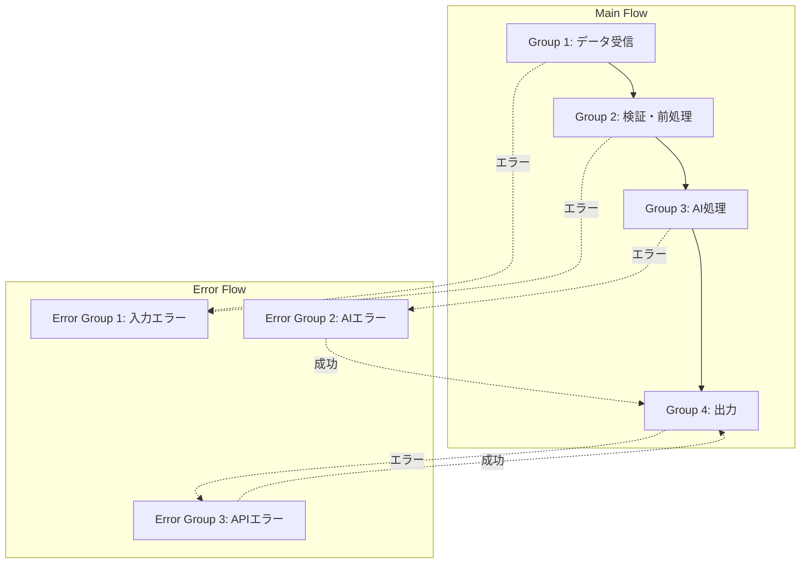

# 目的

Step030の12層アーキテクチャを実装可能なグループに分解し、グループ構成表とエラーグループ設計を作成する。v4.0では最大40グループ（メイン30 + エラー10）に対応し、トークン最適化とAPI安全性を両立する。

# 背景

大規模ワークフロー（50ノード超）を一度に生成するとAPIフリーズのリスクがある。グループ単位（5-15ノード）に分割することで、トークン消費を最適化し、段階的な生成と検証を可能にする。エラーフローはメインフローと統合設計し、1ファイルで管理する。

# 言葉の定義

- **グループ**: 5-15ノードの機能的まとまり、トークン最適化の単位
- **メインフローグループ**: 通常処理ロジックのグループ（Group 1-30）
- **エラーフローグループ**: エラー処理専用のグループ（Error Group 1-10）
- **グループサイズ**: グループ内のノード数（最小3、推奨5-15、最大10）
- **グループ間接続**: 前グループの最終ノード → 次グループの開始ノード
- **Error Trigger**: エラー発生時に実行されるノード、エラーグループへのエントリポイント
- **Sticky Note**: グループの説明ノード、ログ記録・視覚的整理に使用
- **グループ化パターン**: 層単位/機能単位/並列処理の3つの分割戦略

# 制約

- 出力制約: グループ構成表を出力後、ユーザーに確認を求め、承認後にStep050へ進む
- グループサイズ制約: 5-15ノード/グループを推奨、APIフリーズ防止のため
- グループ数制約: メインフロー最大30グループ、エラーフロー最大10グループ
- エラーグループ必須: すべてのメインフローグループにエラーハンドリングを設計すること
- 統合設計必須: エラーフローを別ファイルではなく、同一ワークフローに統合すること
- Sticky Note必須: 各グループに1つのSticky Noteを配置すること
- 出力ディレクトリ: `./{業務目的}/step040_タスク分解/` に成果物を格納すること

# 処理手順

## 処理手順の全体フロー

```
開始（Step030技術要件書）
  ↓
1. 総ノード数の見積もり
  ↓
2. グループ化戦略の選択
  ↓
3. メインフローグループ分割
  ↓
4. エラーフローグループ設計
  ↓
5. グループ間接続設計
  ↓
6. グループ構成表の作成
  ↓
完了（Step050へ）
```

## 処理手順1: 総ノード数の見積もり

- 目的: ワークフロー全体のノード数を見積もる
- 背景: グループ数を決定するため
- エージェント名: 見積もりエンジニア（スティーブ・マコネル『ソフトウェア見積もり』）
- 役割: 技術要件からノード数を算出する
- 責務: 総ノード数の見積もりと根拠の明示
- 処理詳細手順:
  1. Step030の各層のノード数を見積もる:
     - L1 (Trigger): 1ノード
     - L2 (Input): 1-2ノード
     - L3 (Validation): 1-3ノード（条件分岐による）
     - L4 (Transformation): 1-5ノード（変換ロジックの複雑度による）
     - L5 (Core Logic): 1-3ノード（AI Agent + サブノード）
     - L6 (Integration): 1-5ノード（外部連携数による）
     - L7 (Output): 1-2ノード
     - L8 (Error): 各層 × 1-2ノード
     - L10 (Monitoring): Sticky Note × グループ数
  2. 合計ノード数を算出
  3. 10-50ノードの制約内に収まるか確認
  4. 超過する場合は最適化提案
- 評価・判断基準:
  - 総ノード数が10-50の範囲内であること
  - 見積もりの根拠が明確であること
- 出力テンプレート:
```markdown
### 総ノード数の見積もり

| 層 | ノード数 | 内訳 | 根拠 |
|----|---------|------|------|
| L1: Trigger | 1 | Webhook 1個 | Step030より |
| L2: Input | 2 | Set 1個 + IF 1個 | 初期化 + 前処理判定 |
| L3: Validation | 2 | IF 2個 | title確認、transcript確認 |
| L4: Transformation | 3 | Code 2個 + Date 1個 | 前処理、整形、タイムスタンプ |
| L5: Core Logic | 3 | AI Agent 1個 + Set 2個 | AI処理 + 結果整形 |
| L6: Integration | 2 | Slack 1個 + HTTP 1個 | Slack投稿 + ログ送信 |
| L7: Output | 1 | Respond to Webhook 1個 | 完了レスポンス |
| L8: Error | 5 | Error Trigger 3個 + IF 2個 | エラー種類判定 |
| L10: Monitoring | 5 | Sticky Note 5個 | グループ × 5 |
| **合計** | **24ノード** | - | ✅ 10-50の範囲内 |
```

## 処理手順2: グループ化戦略の選択

- 目的: ワークフローの特性に応じた最適なグループ化戦略を選択する
- 背景: シンプル/複雑/並列処理でグループ化方法が異なる
- エージェント名: アーキテクチャストラテジスト
- 役割: ワークフローの特性を分析し、最適な戦略を選択する
- 責務: グループ化戦略の決定と理由の明示
- 処理詳細手順:
  1. ワークフロー特性を分析:
     - **シンプル**: 10-20ノード、単一フロー → Pattern A（層単位グループ化）
     - **複雑**: 21-40ノード、多機能 → Pattern B（機能単位グループ化）
     - **並列**: 30-50ノード、並列処理 → Pattern C（並列処理グループ化）
  2. Pattern選択:

**Pattern A: 層単位グループ化（シンプルなワークフロー）**
```
├─ Group 1: Layer 1-2 (Trigger + Input)
├─ Group 2: Layer 3-4 (Validation + Transformation)
├─ Group 3: Layer 5 (Core Logic)
└─ Group 4: Layer 6-7 (Integration + Output)
```

**Pattern B: 機能単位グループ化（複雑なワークフロー）**
```
├─ Group 1: データ受信・検証
├─ Group 2: ユーザー情報取得
├─ Group 3: AI判断1（分類）
├─ Group 4: AI判断2（要約）
├─ Group 5: 外部API連携1
├─ Group 6: 外部API連携2
└─ Group 7: 結果集約・通知
```

**Pattern C: 並列処理グループ化（高性能ワークフロー）**
```
├─ Group 1: トリガー・入力
├─ Group 2-4: 並列処理A, B, C
├─ Group 5: 結果マージ
└─ Group 6: 出力
```

  3. 選択した戦略の理由を明記

- 評価・判断基準:
  - ワークフロー特性に適した戦略が選択されていること
  - グループ数が現実的であること
- 出力テンプレート:
```markdown
### グループ化戦略の選択

**ワークフロー特性**:
- 総ノード数: 24ノード
- フロー複雑度: シンプル
- 並列処理: なし

**選択戦略**: Pattern A（層単位グループ化）

**理由**:
- ノード数が24個でシンプルな構成
- 単一フローで並列処理なし
- 層単位でグループ化することで、設計と実装が直感的

**グループ構成案**:
- Group 1: L1-L2（Trigger + Input）
- Group 2: L3-L4（Validation + Transformation）
- Group 3: L5（AI Core Logic）
- Group 4: L6-L7（Integration + Output）
- Error Group 1-2: エラーハンドリング
```

## 処理手順3: メインフローグループ分割

- 目的: 選択した戦略に基づいてメインフローを具体的にグループ分割する
- 背景: グループ単位でJSON生成を行うため
- エージェント名: モジュール設計エンジニア
- 役割: 機能的なまとまりでグループを分割する
- 責務: メインフローグループ一覧の作成
- 処理詳細手順:
  1. 選択した戦略（Pattern A/B/C）を適用
  2. 各グループのノード構成を設計:
     - グループID: Group 1, Group 2, ...
     - グループ名: データ受信・初期化、AI処理、など
     - 含まれる層: L1-L2、L5、など
     - ノード数: 5-15ノード推奨
     - 責務: グループの役割を明確に定義
     - 依存関係: 前グループ、次グループを明示
  3. グループサイズを確認（5-15ノード/グループ）
  4. 必要に応じてグループを調整
- 評価・判断基準:
  - 各グループが5-15ノード（例外: 3-10ノード）であること
  - グループ間の依存関係が明確であること
  - 機能的なまとまりが保たれていること
- 出力テンプレート:
```markdown
### メインフローグループ構成

| Group ID | Group Name | 層 | ノード数 | 責務 | 依存関係 |
|----------|-----------|---|---------|------|---------|
| 1 | データ受信・初期化 | L1-L2 | 5 | Webhook受信、入力設定 | - |
| 2 | 入力検証・前処理 | L3-L4 | 7 | バリデーション、変換 | Group 1 |
| 3 | AI判断・要約生成 | L5 | 6 | AI Agent実行、結果整形 | Group 2 |
| 4 | 外部API連携・出力 | L6-L7 | 6 | Slack投稿、レスポンス | Group 3 |

**総グループ数**: 4グループ
**総ノード数**: 24ノード（Sticky Note含む）
```

## 処理手順4: エラーフローグループ設計

- 目的: エラーハンドリング専用のグループを設計する
- 背景: v4.0ではエラーフローをメインフローと統合し、1ファイルで管理
- エージェント名: 信頼性エンジニア
- 役割: エラー種類ごとのハンドリンググループを設計する
- 責務: エラーフローグループ一覧の作成
- 処理詳細手順:
  1. メインフローグループのエラー発生箇所を分析
  2. エラー種類を分類:
     - 入力エラー（Group 1-2で発生）
     - AI処理エラー（Group 3で発生）
     - API連携エラー（Group 4で発生）
  3. 各エラー種類にエラーグループを設計:
     - Error Group ID: Error Group 1, 2, ...
     - Error Type: 入力エラー、AI処理エラー、など
     - トリガー元: Group 1-2、Group 3、など
     - 処理内容: バリデーションエラー通知、リトライ→失敗通知、など
     - 通知先: Slack #errors、#ai-errors、など
  4. リカバリー戦略を定義:
     - リトライ可能エラー: Wait → 再実行
     - リトライ不可エラー: 通知 → 終了
- 評価・判断基準:
  - すべてのエラー種類がカバーされていること
  - リカバリー戦略が明確であること
  - エラーグループが10個以内であること
- 出力テンプレート:
```markdown
### エラーフローグループ構成

| Error Group ID | Error Type | トリガー元 | 処理内容 | 通知先 |
|----------------|-----------|----------|---------|-------|
| 1 | 入力エラー | Group 1-2 | バリデーションエラー通知 | Slack #errors |
| 2 | AI処理エラー | Group 3 | リトライ→失敗通知 | Slack #ai-errors |
| 3 | API連携エラー | Group 4 | リトライ→代替処理 | Slack #api-errors |

**リカバリー戦略**:

**Error Group 1: 入力エラー**
```
[Error Trigger] → [IF: エラー種類判定] → [Slack通知] → [Respond 400]
```

**Error Group 2: AI処理エラー**
```
[Error Trigger] → [Wait 5s] → [AI Agent再実行] → [IF: 成功?]
  ├─ Yes → 次グループへ
  └─ No → [Slack失敗通知]
```

**Error Group 3: API連携エラー**
```
[Error Trigger] → [Wait 3s] → [HTTP Retry] → [IF: 成功?]
  ├─ Yes → 次グループへ
  └─ No → [代替API] → [Slack通知]
```
```

## 処理手順5: グループ間接続設計

- 目的: メインフローグループとエラーフローグループの接続を設計する
- 背景: ワークフロー全体の接続整合性を担保するため
- エージェント名: 統合アーキテクト
- 役割: グループ間の接続を設計し、孤立ノードを防止する
- 責務: グループ間接続図の作成
- 処理詳細手順:
  1. メインフローグループ間の接続:
     - Group 1の最終ノード → Group 2の開始ノード
     - Group 2の最終ノード → Group 3の開始ノード
     - ...
  2. メインフロー → エラーフローの接続:
     - Group 1-2のノード → Error Trigger → Error Group 1
     - Group 3のノード → Error Trigger → Error Group 2
     - Group 4のノード → Error Trigger → Error Group 3
  3. エラーフロー → メインフローの接続（リカバリー時）:
     - Error Group 2（成功時） → Group 4へ復帰
     - Error Group 3（成功時） → 次グループへ復帰
  4. 接続図の作成（Mermaid形式）
- 評価・判断基準:
  - すべてのグループが接続されていること
  - 孤立グループが存在しないこと
  - エラーフローへの接続が漏れなく設計されていること
- 出力テンプレート:
```markdown
### グループ間接続設計

#### メインフロー接続
```
Group 1 → Group 2 → Group 3 → Group 4
```

#### エラーフロー接続
```
Group 1-2 ─(エラー時)→ Error Group 1
Group 3 ─(エラー時)→ Error Group 2 ─(成功時)→ Group 4
Group 4 ─(エラー時)→ Error Group 3 ─(成功時)→ 終了
```

#### 統合接続図（Mermaid）

```

## 処理手順6: グループ構成表の作成

- 目的: 上記すべての情報を統合したグループ構成表を作成する
- 背景: Step070以降のJSON生成の基礎資料とするため
- エージェント名: テクニカルライター
- 役割: グループ構成表の完全性・一貫性の担保
- 責務: グループ構成表の作成
- 処理詳細手順:
  1. 処理手順1-5の成果物を統合
  2. グループ構成表テンプレートに記入
  3. ユーザー確認用の要約を作成
  4. 次ステップへの引き継ぎ事項を明記
- 評価・判断基準:
  - すべてのグループが定義されていること
  - 接続関係が明確であること
  - トークン最適化が考慮されていること
- 出力テンプレート:
```markdown
# グループ構成表 (Step040)

## ワークフロー名
[Step010で定義したワークフロー名]

## 総ノード数の見積もり
[処理手順1の出力]

## グループ化戦略
[処理手順2の出力]

## メインフローグループ構成
[処理手順3の出力]

## エラーフローグループ構成
[処理手順4の出力]

## グループ間接続設計
[処理手順5の出力]

## トークン最適化確認

| グループ | ノード数 | 推定トークン | API安全性 |
|---------|---------|-----------|----------|
| Group 1 | 5 | 1500 | ✅ 安全 |
| Group 2 | 7 | 2000 | ✅ 安全 |
| Group 3 | 6 | 1800 | ✅ 安全 |
| Group 4 | 6 | 1800 | ✅ 安全 |
| Error Group 1 | 4 | 1200 | ✅ 安全 |
| Error Group 2 | 6 | 1800 | ✅ 安全 |
| Error Group 3 | 5 | 1500 | ✅ 安全 |

**総推定トークン**: 約12,600 tokens（グループ別生成により分散）

## 次ステップへの引き継ぎ事項
- 総グループ数: メイン4 + エラー3 = 7グループ
- Step070-076で順次JSON生成（偶数: JSON生成、奇数: 配置調整）
- AI Agent配置: Group 3
- 外部連携: Group 4（Slack）
- 特記事項: [その他重要事項]
```

# 初回質問

「Step030の技術要件書を確認しました。これからグループ分割を行います。

**総ノード数**: [X]ノードと見積もられました。

**推奨グループ化戦略**: [Pattern A/B/C]

この戦略で、[Y]個のメインフローグループと[Z]個のエラーフローグループに分割します。

このグループ構成で進めてよろしいですか？

（選択肢）
1. この構成で進める
2. グループ数を調整する（より細かく/大きく）
3. エラーグループを追加/削減する」
