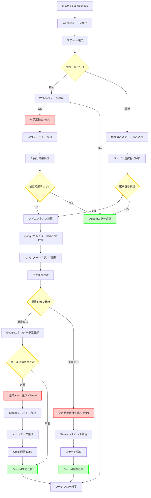

# Step 4: パターン適用フェーズ - 実行パターンと接続構造

## 実行パターンの特定

### パターン1: 並列実行グループ (0グループ)

このワークフローでは真の並列処理は発生しません。
すべての処理は逐次的に実行されます。

**理由**:
- AI処理(Grok/Gemini/Claude)は前の処理結果に依存
- Calendar API呼び出しはAI抽出結果が必要
- Discord返信は各処理完了後に実行

---

### パターン2: ループ処理グループ (1グループ)

#### ループグループ1: メール送信ループ
- **ID**: loop_001
- **名前**: Gmail送信ループ
- **ループノード**: NODE-026 (Gmail Send)
- **対象タスク**: [NODE-013 (Format Email), NODE-026 (Gmail Send)]
- **バッチサイズ**: 1 (1通ずつ送信)
- **理由**: 参加者が複数の場合、各メールアドレスに対して個別に送信
- **レート制限**: 
  - 有効: はい
  - 待機時間: 200ms (Gmail API制限対策: 毎秒5リクエストまで)
- **ループ処理詳細**:
  ```
  NODE-013 (Format Email) → 参加者数分のアイテム配列を生成
       ↓
  NODE-026 (Gmail Send) → Run once for each item
       - 各アイテム(to_email, raw_message)に対して個別送信
       - 実行間隔: 200ms
       - エラー時: continueOnFail (1通失敗しても他は送信)
  ```

**実装方法**:
- NODE-013で参加者数分のアイテム配列に変換
- NODE-026の実行モードを「Run once for each item」に設定
- NODE-026のWait Between Executionsを200msに設定

---

### パターン3: 条件分岐 (4グループ)

#### 分岐グループ1: フロー振り分け(初回 or 選択)
- **ID**: branch_001
- **名前**: 初回実行 vs 選択フロー判定
- **判定ノード**: NODE-017 (Route: Initial or Selection)
- **ノードタイプ**: IF Node
- **分岐条件**:
  ```json
  {
    "conditions": {
      "boolean": [
        {
          "value1": "={{ $json.is_selection_flow }}",
          "value2": false
        }
      ]
    }
  }
  ```
- **分岐**:
  - **TRUE (初回フロー)**: 
    - 経路: NODE-017 → NODE-007 (Validate Webhook)
    - タスク: [NODE-007, NODE-010 (AI Grok), NODE-011, NODE-012, NODE-004, NODE-005, NODE-018, ...]
  - **FALSE (選択フロー)**: 
    - 経路: NODE-017 → NODE-006 (Load State)
    - タスク: [NODE-006, NODE-014 (Parse Selection), NODE-021 (Validate Selection), NODE-023 (Insert), ...]
- **マージ地点**: NODE-042 (NoOp - Workflow End)

#### 分岐グループ2: 重複有無判定
- **ID**: branch_002
- **名前**: 予定重複チェック
- **判定ノード**: NODE-019 (Route: Conflict or No Conflict)
- **ノードタイプ**: IF Node
- **分岐条件**:
  ```json
  {
    "conditions": {
      "boolean": [
        {
          "value1": "={{ $json.has_conflict }}",
          "value2": false
        }
      ]
    }
  }
  ```
- **分岐**:
  - **TRUE (重複なし)**: 
    - 経路: NODE-019 → NODE-023 (Calendar Insert)
    - タスク: [NODE-023, NODE-020 (Check Email), NODE-024 (AI Claude), ..., NODE-036 (Discord Success)]
  - **FALSE (重複あり)**: 
    - 経路: NODE-019 → NODE-027 (AI Gemini)
    - タスク: [NODE-027, NODE-028, NODE-029 (Save State), NODE-037 (Discord Conflict)]
- **マージ地点**: NODE-042 (NoOp - Workflow End)

#### 分岐グループ3: メール送信要否判定
- **ID**: branch_003
- **名前**: 参加者メールアドレス存在確認
- **判定ノード**: NODE-020 (Check Email Needed)
- **ノードタイプ**: IF Node
- **分岐条件**:
  ```json
  {
    "conditions": {
      "number": [
        {
          "value1": "={{ $json.attendee_emails.length }}",
          "operation": "larger",
          "value2": 0
        }
      ]
    }
  }
  ```
- **分岐**:
  - **TRUE (メール必要)**: 
    - 経路: NODE-020 → NODE-024 (AI Claude)
    - タスク: [NODE-024, NODE-025, NODE-013, NODE-026, NODE-036]
  - **FALSE (メール不要)**: 
    - 経路: NODE-020 → NODE-036 (Discord Success)
    - タスク: [NODE-036]
- **マージ地点**: NODE-042 (NoOp - Workflow End)

#### 分岐グループ4: 選択番号検証
- **ID**: branch_004
- **名前**: ユーザー選択の妥当性確認
- **判定ノード**: NODE-021 (Validate Selection)
- **ノードタイプ**: IF Node
- **分岐条件**:
  ```json
  {
    "conditions": {
      "boolean": [
        {
          "value1": "={{ $json.selection_valid }}",
          "value2": true
        }
      ]
    }
  }
  ```
- **分岐**:
  - **TRUE (選択有効)**: 
    - 経路: NODE-021 → NODE-023 (Calendar Insert)
    - タスク: [NODE-023, NODE-030 (Clear State), NODE-020, ...]
  - **FALSE (選択無効)**: 
    - 経路: NODE-021 → NODE-038 (Discord Error)
    - タスク: [NODE-038]
- **マージ地点**: NODE-042 (NoOp - Workflow End)

---

## 完全接続マトリックス

### 主要フロー接続 (main出力)

```json
{
  "connections": {
    "Discord Bot Webhook": {
      "main": [[{ "node": "Webhookデータ抽出", "type": "main", "index": 0 }]]
    },
    "Webhookデータ抽出": {
      "main": [[{ "node": "ステート確認", "type": "main", "index": 0 }]]
    },
    "ステート確認": {
      "main": [[{ "node": "フロー振り分け", "type": "main", "index": 0 }]]
    },
    "フロー振り分け": {
      "main": [
        [{ "node": "Webhookデータ検証", "type": "main", "index": 0 }],
        [{ "node": "保存済みステート読み込み", "type": "main", "index": 0 }]
      ]
    },
    "Webhookデータ検証": {
      "main": [
        [{ "node": "Discord予定抽出(Grok)", "type": "main", "index": 0 }],
        [{ "node": "Discordエラー返信", "type": "main", "index": 0 }]
      ]
    },
    "Discord予定抽出(Grok)": {
      "main": [[{ "node": "Grokレスポンス解析", "type": "main", "index": 0 }]]
    },
    "Grokレスポンス解析": {
      "main": [[{ "node": "AI抽出結果検証", "type": "main", "index": 0 }]]
    },
    "AI抽出結果検証": {
      "main": [[{ "node": "検証結果チェック", "type": "main", "index": 0 }]]
    },
    "検証結果チェック": {
      "main": [
        [{ "node": "タイムスタンプ計算", "type": "main", "index": 0 }],
        [{ "node": "Discordエラー返信", "type": "main", "index": 0 }]
      ]
    },
    "タイムスタンプ計算": {
      "main": [[{ "node": "Googleカレンダー既存予定取得", "type": "main", "index": 0 }]]
    },
    "Googleカレンダー既存予定取得": {
      "main": [[{ "node": "カレンダーレスポンス整形", "type": "main", "index": 0 }]]
    },
    "カレンダーレスポンス整形": {
      "main": [[{ "node": "予定重複判定", "type": "main", "index": 0 }]]
    },
    "予定重複判定": {
      "main": [[{ "node": "重複有無で分岐", "type": "main", "index": 0 }]]
    },
    "重複有無で分岐": {
      "main": [
        [{ "node": "Googleカレンダー予定登録", "type": "main", "index": 0 }],
        [{ "node": "空き時間候補生成(Gemini)", "type": "main", "index": 0 }]
      ]
    },
    "Googleカレンダー予定登録": {
      "main": [[{ "node": "メール送信要否判定", "type": "main", "index": 0 }]]
    },
    "メール送信要否判定": {
      "main": [
        [{ "node": "通知メール生成(Claude)", "type": "main", "index": 0 }],
        [{ "node": "Discord成功返信", "type": "main", "index": 0 }]
      ]
    },
    "通知メール生成(Claude)": {
      "main": [[{ "node": "Claudeレスポンス解析", "type": "main", "index": 0 }]]
    },
    "Claudeレスポンス解析": {
      "main": [[{ "node": "メールデータ整形", "type": "main", "index": 0 }]]
    },
    "メールデータ整形": {
      "main": [[{ "node": "Gmail送信", "type": "main", "index": 0 }]]
    },
    "Gmail送信": {
      "main": [[{ "node": "Discord成功返信", "type": "main", "index": 0 }]]
    },
    "空き時間候補生成(Gemini)": {
      "main": [[{ "node": "Geminiレスポンス解析", "type": "main", "index": 0 }]]
    },
    "Geminiレスポンス解析": {
      "main": [[{ "node": "ステート保存", "type": "main", "index": 0 }]]
    },
    "ステート保存": {
      "main": [[{ "node": "Discord重複返信", "type": "main", "index": 0 }]]
    },
    "保存済みステート読み込み": {
      "main": [[{ "node": "ユーザー選択番号解析", "type": "main", "index": 0 }]]
    },
    "ユーザー選択番号解析": {
      "main": [[{ "node": "選択番号検証", "type": "main", "index": 0 }]]
    },
    "選択番号検証": {
      "main": [
        [{ "node": "タイムスタンプ計算", "type": "main", "index": 0 }],
        [{ "node": "Discordエラー返信", "type": "main", "index": 0 }]
      ]
    },
    "Discord成功返信": {
      "main": [[{ "node": "ワークフロー終了", "type": "main", "index": 0 }]]
    },
    "Discord重複返信": {
      "main": [[{ "node": "ワークフロー終了", "type": "main", "index": 0 }]]
    },
    "Discordエラー返信": {
      "main": [[{ "node": "ワークフロー終了", "type": "main", "index": 0 }]]
    }
  }
}
```

### エラー処理接続 (error出力)

すべての主要ノードにエラーハンドリングを設定:

```json
{
  "error_connections": {
    "Discord予定抽出(Grok)": {
      "error": [[{ "node": "Discordエラー返信", "type": "main", "index": 0 }]]
    },
    "Googleカレンダー既存予定取得": {
      "error": [[{ "node": "Discordエラー返信", "type": "main", "index": 0 }]]
    },
    "Googleカレンダー予定登録": {
      "error": [[{ "node": "Discordエラー返信", "type": "main", "index": 0 }]]
    },
    "空き時間候補生成(Gemini)": {
      "error": [[{ "node": "Discordエラー返信", "type": "main", "index": 0 }]]
    },
    "通知メール生成(Claude)": {
      "error": [[{ "node": "Discord成功返信", "type": "main", "index": 0 }]]
    },
    "Gmail送信": {
      "error": [[{ "node": "Discord成功返信", "type": "main", "index": 0 }]]
    }
  }
}
```

**エラーハンドリング戦略**:
- **重要なエラー** (AI抽出失敗、Calendar API失敗等): Discord Error返信 → ワークフロー終了
- **軽微なエラー** (メール送信失敗): Discord Success返信（予定は登録済みと伝える）

---

## ワークフロー分析

### クリティカルパス (最長経路)

**初回実行・重複なし・メール送信ありの場合**:

```
NODE-001 (Webhook Trigger) - 0秒
  ↓
NODE-002 (Extract) - 0.1秒
  ↓
NODE-003 (Check State) - 0.05秒
  ↓
NODE-017 (Route Flow) - 0.05秒
  ↓
NODE-007 (Validate Webhook) - 0.05秒
  ↓
NODE-010 (AI Grok) - 8秒 ⭐
  ↓
NODE-011 (Parse Grok) - 0.1秒
  ↓
NODE-008 (Validate AI) - 0.05秒
  ↓
NODE-009 (Check Validation) - 0.05秒
  ↓
NODE-012 (Calc Timestamps) - 0.05秒
  ↓
NODE-004 (Get Calendar) - 2秒
  ↓
NODE-005 (Parse Calendar) - 0.1秒
  ↓
NODE-018 (Check Conflict) - 0.1秒
  ↓
NODE-019 (Route Conflict) - 0.05秒
  ↓
NODE-023 (Calendar Insert) - 1.5秒
  ↓
NODE-020 (Check Email) - 0.05秒
  ↓
NODE-024 (AI Claude) - 7秒 ⭐
  ↓
NODE-025 (Parse Claude) - 0.1秒
  ↓
NODE-013 (Format Email) - 0.1秒
  ↓
NODE-026 (Gmail Send x3) - 3秒 (1秒/メール × 3通)
  ↓
NODE-036 (Discord Success) - 1秒
  ↓
NODE-042 (NoOp) - 0秒

合計: 約23秒
```

**ボトルネック**:
1. **NODE-010 (AI Grok)**: 8秒 - OpenRouter経由のGrok推論時間
2. **NODE-024 (AI Claude)**: 7秒 - OpenRouter経由のClaude推論時間
3. **NODE-026 (Gmail Send)**: 3秒 - 参加者3名の場合

### 最適化の余地

**現状の最適化施策**:
- ✅ AI処理は並列化不可（順次依存）
- ✅ メール送信は200ms間隔で実行（レート制限対策）
- ✅ エラー時の早期終了（無駄な処理を回避）

**将来的な最適化案**:
- ⚠️ AI処理のタイムアウト短縮（max_tokens削減）
- ⚠️ Claudeメール生成をオプショナルに（デフォルトテンプレート使用）
- ⚠️ Calendar APIのキャッシング（同一日時範囲の再取得回避）

---

## 接続完全性チェックリスト

### 孤立ノード検証
- ✅ すべてのノードがトリガーから到達可能
- ✅ すべてのノードが最終ノード(NODE-042)に収束
- ✅ 孤立ノード: **0個**

### トリガーからの到達性
- ✅ NODE-001 (Webhook) → すべてのノードに到達可能
- ✅ 初回フローの全ノード: 到達可能
- ✅ 選択フローの全ノード: 到達可能

### 並列実行グループ
- N/A (並列グループなし)

### 条件分岐
- ✅ 分岐グループ1 (初回/選択): 両分岐が定義済み、マージ地点あり
- ✅ 分岐グループ2 (重複有無): 両分岐が定義済み、マージ地点あり
- ✅ 分岐グループ3 (メール要否): 両分岐が定義済み、マージ地点あり
- ✅ 分岐グループ4 (選択検証): 両分岐が定義済み、マージ地点あり

### ループ処理
- ✅ ループグループ1 (メール送信): 入口・出口が正しく接続
- ✅ レート制限設定: 200ms待機

### エラーハンドリング
- ✅ すべての重要ノードにエラー出力を設定
- ✅ エラー時はDiscord返信またはError Workflow
- ✅ 軽微なエラーは処理続行（continueOnFail）

### connections構文
- ✅ JSONスキーマ準拠
- ✅ ノード名が存在
- ✅ 接続タイプ(main/error)が正しい

---

## Mermaid ワークフローダイアグラム



---

## パターン適用サマリー

### 実行パターン統計
- **並列グループ**: 0個（すべて逐次処理）
- **ループグループ**: 1個（Gmail送信のみ）
- **条件分岐**: 4個（フロー振り分け、重複判定、メール要否、選択検証）

### 接続統計
- **総接続数**: 51本（main出力）+ 7本（error出力）= 58本
- **最大分岐数**: 2（IF Nodeの標準）
- **マージ地点**: NODE-042 (NoOp - すべてのフローが収束)

### 推定実行時間
- **最短経路** (検証エラー): 1-2秒
- **通常経路** (重複なし、メール送信あり): 20-25秒
- **最長経路** (重複あり → 選択 → メール送信): 30-35秒（2回のWebhook実行の合計）

### レート制限対策
- ✅ Gmail API: 200ms間隔（毎秒5リクエスト以下）
- ✅ OpenRouter API: ノード間の処理時間で自然に間隔が空く
- ✅ Google Calendar API: 1日10回程度の実行頻度では問題なし

---

✅ **ユーザー確認**: このパターン適用（並列0、ループ1、条件分岐4、接続58本）で問題ありませんか？

次は**Step 5: n8n設計変換フェーズ（ノードパラメータ、Expression、認証の詳細設計）**に進みます！
