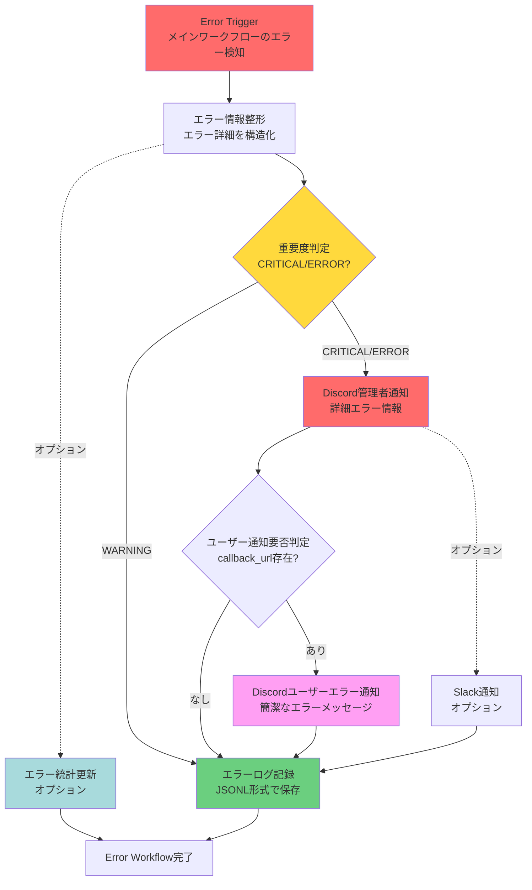

# Step 8: Error Workflow生成 - 完了ドキュメント

**生成日**: 2025-11-06
**ワークフロー名**: Discord Calendar Manager - Error Handling
**ファイル**: `step8_error_workflow.json`

---

## 📊 Error Workflow概要

メインワークフロー「Discord Calendar Manager」のエラーハンドリング専用ワークフローです。

### 主要機能
1. ✅ **エラー自動検知**: Error Triggerでメインワークフローのエラーを自動キャッチ
2. ✅ **重要度判定**: CRITICAL/ERROR/WARNINGの3段階で自動分類
3. ✅ **多重通知**: Discord管理者通知 + ユーザー通知 + Slack通知（オプション）
4. ✅ **詳細ログ記録**: JSON Lines形式でエラー履歴を永続化
5. ✅ **統計情報収集**: エラー傾向分析用の統計データを蓄積

---

## 🗺️ ワークフローフロー図



---

## 📦 ノード構成

### 1. Error Trigger (error_trigger_001)
**タイプ**: `n8n-nodes-base.errorTrigger`
**役割**: メインワークフローでエラーが発生した際に自動実行

**取得情報**:
- エラーメッセージ
- エラー発生ノード名
- 実行ID
- タイムスタンプ
- エラースタックトレース
- 入力データ（エラー発生時のコンテキスト）

---

### 2. エラー情報整形 (code_002)
**タイプ**: `n8n-nodes-base.code`
**役割**: エラー情報を読みやすい形式に整形

**処理内容**:
```javascript
// 1. エラー基本情報の抽出
const errorNodeName = error.node?.name || 'Unknown Node';
const errorMessage = error.error?.message || 'Unknown Error';
const errorStack = error.error?.stack || '';

// 2. 重要度判定
let severity = 'ERROR';
if (errorMessage.includes('timeout')) severity = 'WARNING';
if (errorMessage.includes('authentication')) severity = 'CRITICAL';

// 3. ユーザーコンテキストの抽出
const userId = inputData.user_id || 'Unknown';
const messageContent = inputData.message_content || 'Unknown';

// 4. Discord通知用フォーマット済みメッセージ生成
const discord_message = `🚨 **エラー発生** [${severity}]\n...`;

// 5. ログ記録用詳細情報
const log_entry = { ... };
```

**出力フィールド**:
| フィールド | 説明 |
|-----------|------|
| `error_node_name` | エラー発生ノード名 |
| `error_message` | エラーメッセージ |
| `error_stack` | スタックトレース（最初の5行） |
| `severity` | 重要度 (CRITICAL/ERROR/WARNING) |
| `execution_id` | 実行ID |
| `timestamp` | 発生時刻（日本時間） |
| `user_id` | ユーザーID |
| `message_content` | ユーザーのメッセージ |
| `callback_url` | Discord Webhook URL |
| `discord_message` | Discord通知用フォーマット済みメッセージ |
| `log_entry` | ログ記録用詳細情報 |

**重要度判定ロジック**:
- **CRITICAL**: 認証エラー (`authentication`)、API障害
- **ERROR**: 一般的なエラー（デフォルト）
- **WARNING**: タイムアウト (`timeout`, `ETIMEDOUT`)、バリデーションエラー (`validation`, `Invalid`)

---

### 3. 重要度判定 (if_003)
**タイプ**: `n8n-nodes-base.if`
**役割**: エラー重要度で処理を分岐

**分岐条件**:
```javascript
severity !== 'WARNING'
```

**分岐1 (true)**: CRITICAL/ERROR → Discord管理者通知へ
**分岐2 (false)**: WARNING → ログ記録のみ

---

### 4. Discord管理者通知 (http_004)
**タイプ**: `n8n-nodes-base.httpRequest`
**役割**: 管理者用Discordチャンネルにエラー詳細を通知

**通知内容**:
```
🚨 **エラー発生** [CRITICAL/ERROR]

**ワークフロー**: Discord Calendar Manager
**エラー発生ノード**: 【AI Agent 1】Discord予定抽出
**エラーメッセージ**: Invalid JSON format
**実行ID**: abc123def456
**発生時刻**: 2025-11-06 15:30:45
**ユーザーID**: user_123
**メッセージ内容**: 明日の14時から1時間、田中さん...

**スタックトレース**:
```
Error: Invalid JSON format
    at parseJSON (...)
    at AI Agent Node (...)
    ...
```

管理者に報告してください。
```

**設定**:
- **URL**: `YOUR_ADMIN_DISCORD_WEBHOOK_URL`（要置き換え）
- **タイムアウト**: 10秒
- **リトライ**: 2回、1秒間隔
- **continueOnFail**: true（通知失敗してもワークフロー継続）

---

### 5. ユーザー通知要否判定 (if_005)
**タイプ**: `n8n-nodes-base.if`
**役割**: ユーザーへのエラー通知が必要かを判定

**判定条件**:
```javascript
callback_url !== '' && callback_url !== 'YOUR_ADMIN_DISCORD_WEBHOOK_URL'
```

**分岐1 (true)**: callback_urlが存在し、管理者チャンネルと異なる → ユーザー通知へ
**分岐2 (false)**: callback_urlが空、または管理者チャンネルと同じ → ログ記録へ

---

### 6. Discordユーザーエラー通知 (http_006)
**タイプ**: `n8n-nodes-base.httpRequest`
**役割**: ユーザーに簡潔なエラーメッセージを通知

**通知内容**:
```
❌ エラーが発生しました

予定の登録に失敗しました。
エラー内容: Invalid JSON format

管理者に報告済みです。しばらく待ってから再度お試しください。

実行ID: abc123def456
```

**特徴**:
- ユーザーフレンドリーな表現
- 技術的な詳細は含めない
- 実行IDを提示（問い合わせ時の参照用）
- 対処方法の案内

---

### 7. エラーログ記録 (file_007)
**タイプ**: `n8n-nodes-base.writeFile`
**役割**: 全エラーをJSONファイルに記録

**ファイル設定**:
- **パス**: `/tmp/n8n_discord_calendar_errors.jsonl`
- **フォーマット**: JSON Lines（1行1エラー）
- **操作**: append（追記）
- **エンコーディング**: UTF-8

**記録内容**:
```json
{
  "timestamp": "2025-11-06 15:30:45",
  "severity": "ERROR",
  "workflow": "Discord Calendar Manager",
  "execution_id": "abc123def456",
  "error_node": "【AI Agent 1】Discord予定抽出",
  "error_message": "Invalid JSON format",
  "error_stack": "Error: Invalid JSON format\n    at parseJSON (...)",
  "user_id": "user_123",
  "message_content": "明日の14時から1時間、田中さん...",
  "input_data": { ... }
}
```

**用途**:
- ログ分析
- エラー統計
- デバッグ
- 監査証跡

---

### 8. Slack通知（オプション） (http_008)
**タイプ**: `n8n-nodes-base.httpRequest`
**役割**: Slackにエラー通知を送信（オプション）

**通知内容**:
Slack Blocks形式のリッチフォーマット:
- ヘッダー（絵文字 + 重要度）
- エラー詳細（ワークフロー名、実行ID、エラーノード、発生時刻）
- エラーメッセージ（コードブロック）
- ユーザー情報
- フッター（n8n実行ログへのリンク案内）

**設定方法**:
1. Slack Incoming Webhook URLを取得
2. `YOUR_SLACK_WEBHOOK_URL`を実際のURLに置き換え
3. このノードを有効化

**注意**: 使用しない場合はこのノードを削除してください。

---

### 9. エラー統計更新（オプション） (code_009)
**タイプ**: `n8n-nodes-base.code`
**役割**: エラー統計情報を更新（グローバルステート使用）

**統計項目**:
```javascript
{
  total_warnings: 15,      // WARNINGの総数
  total_errors: 8,         // ERRORの総数
  total_critical: 2,       // CRITICALの総数
  last_warning: "2025-11-06 15:30:45",
  last_error: "2025-11-06 14:20:30",
  last_critical: "2025-11-06 10:15:22",
  error_by_node: {
    "【AI Agent 1】Discord予定抽出": 5,
    "Googleカレンダー既存予定取得": 3,
    "Gmail送信": 2
  }
}
```

**用途**:
- エラー傾向分析
- 問題の多いノードの特定
- 定期レポート生成の基礎データ

**注意**: 使用しない場合はこのノードを削除してください。

---

### 10. Error Workflow完了 (noop_010)
**タイプ**: `n8n-nodes-base.noOp`
**役割**: エラーワークフロー正常終了

**到達パターン**:
1. 管理者通知 → ユーザー通知 → ログ記録 → 終了
2. 管理者通知 → ログ記録 → 終了（ユーザー通知スキップ）
3. ログ記録のみ → 終了（WARNING）

**保証**: すべてのパターンでエラーログは必ず記録される。

---

## 🔗 接続マップ

```
Error Trigger
    ↓ (main)
エラー情報整形
    ↓ (main)                    ↓ (main, オプション)
重要度判定                    エラー統計更新（オプション）
    ↓ (CRITICAL/ERROR)  ↓ (WARNING)              ↓
Discord管理者通知      エラーログ記録    Error Workflow完了
    ↓ (main)                    ↓
ユーザー通知要否判定         ↓
    ↓ (あり)  ↓ (なし)         ↓
ユーザー通知  エラーログ記録  ↓
    ↓          ↓               ↓
エラーログ記録              ↓
    ↓                          ↓
Error Workflow完了         ↓
```

**オプション分岐**:
```
Discord管理者通知
    ↓ (main, オプション)
Slack通知（オプション）
    ↓
エラーログ記録
```

---

## ⚙️ メインワークフローとの連携

### メインワークフローのsettings更新

`step7_complete_n8n_workflow_CORRECTED.json`のsettingsに以下を追加:

```json
"settings": {
  "executionOrder": "v1",
  "saveManualExecutions": true,
  "saveExecutionProgress": true,
  "timezone": "Asia/Tokyo",
  "callerPolicy": "workflowsFromSameOwner",
  "executionTimeout": 300,
  "errorWorkflow": "Discord Calendar Manager - Error Handling"
},
```

### 動作仕組み

1. **メインワークフローでエラー発生**
   - 任意のノードで例外がスロー
   - n8nがエラーをキャッチ

2. **Error Workflow自動実行**
   - Error Triggerが発火
   - エラー情報が自動的に渡される

3. **エラーハンドリング**
   - 重要度判定
   - 通知送信
   - ログ記録

4. **メインワークフロー**
   - エラー状態で終了
   - 実行履歴にエラーが記録

---

## 🎯 エラー分類と対応

### CRITICAL（緊急）

**検出条件**:
- 認証エラー（`authentication`キーワード）
- API障害

**対応**:
1. ✅ Discord管理者通知（詳細）
2. ✅ Discordユーザー通知（簡潔）
3. ✅ Slack通知（オプション）
4. ✅ エラーログ記録
5. ✅ 統計更新

**例**:
```
エラーメッセージ: "OpenRouter API authentication failed"
重要度: CRITICAL
対応: すべての通知チャネルでアラート
```

---

### ERROR（エラー）

**検出条件**:
- CRITICAL/WARNINGに該当しない一般的なエラー
- デフォルトの重要度

**対応**:
1. ✅ Discord管理者通知（詳細）
2. ✅ Discordユーザー通知（簡潔）
3. ✅ Slack通知（オプション）
4. ✅ エラーログ記録
5. ✅ 統計更新

**例**:
```
エラーメッセージ: "Invalid JSON format from AI response"
重要度: ERROR
対応: 管理者とユーザーに通知
```

---

### WARNING（警告）

**検出条件**:
- タイムアウト（`timeout`, `ETIMEDOUT`キーワード）
- バリデーションエラー（`validation`, `Invalid`キーワード）

**対応**:
1. ❌ Discord管理者通知（スキップ）
2. ❌ Discordユーザー通知（スキップ）
3. ❌ Slack通知（スキップ）
4. ✅ エラーログ記録
5. ✅ 統計更新

**例**:
```
エラーメッセージ: "Request timeout: ETIMEDOUT"
重要度: WARNING
対応: ログ記録のみ、通知なし
```

---

## 📝 実装手順

### 1. Error Workflowのインポート

```bash
# n8n UIで実行
1. 右上の「...」メニュー → Import from File
2. step8_error_workflow.json を選択
3. 「Import」をクリック
```

### 2. 管理者Discord Webhook URLの設定

Error Workflow内の以下のノードを編集:

**Discord管理者通知 (http_004)**:
```json
"url": "https://discord.com/api/webhooks/YOUR_CHANNEL_ID/YOUR_WEBHOOK_TOKEN"
```

Discord Webhook URLの取得方法:
1. Discordサーバーの管理者チャンネルを開く
2. チャンネル設定 → 連携サービス → Webhookを作成
3. Webhook URLをコピー
4. n8nのノード設定に貼り付け

### 3. メインワークフローのsettings更新

`step7_complete_n8n_workflow_CORRECTED.json`を再インポート（既に更新済み）:
```json
"errorWorkflow": "Discord Calendar Manager - Error Handling"
```

### 4. オプション機能の設定

#### Slack通知を使用する場合:

**Slack通知（オプション） (http_008)**:
```json
"url": "https://hooks.slack.com/services/YOUR/SLACK/WEBHOOK"
```

Slack Incoming Webhook URLの取得方法:
1. Slack App Directory → Incoming Webhooks
2. チャンネルを選択してWebhookを作成
3. Webhook URLをコピー
4. n8nのノード設定に貼り付け

#### Slack通知を使用しない場合:

1. `Slack通知（オプション）`ノードを削除
2. `Discord管理者通知`から`Slack通知（オプション）`への接続を削除

#### エラー統計を使用しない場合:

1. `エラー統計更新（オプション）`ノードを削除
2. `エラー情報整形`から`エラー統計更新（オプション）`への接続を削除

---

## 🧪 テスト方法

### 1. 意図的なエラー発生

メインワークフローで以下のいずれかを実行:

**テスト1: 無効なWebhook URLでテスト**
```json
{
  "user_id": "test_user",
  "channel_id": "test_channel",
  "message_content": "明日の14時から1時間、ミーティング",
  "callback_url": "https://invalid-url.example.com",
  "timestamp": "2025-11-06T12:00:00+09:00"
}
```

**期待される動作**:
1. `Webhookデータ検証`ノードでエラー（callback_url検証失敗）
2. Error Workflowが自動実行
3. 重要度: ERROR
4. Discord管理者通知が送信される
5. ユーザー通知は送信されない（callback_url無効のため）
6. エラーログに記録される

---

**テスト2: AI Agent ノードでエラー**

OpenRouter APIキーを一時的に無効化:
```bash
# n8n UIで実行
1. 認証情報 "openrouter_api" を編集
2. APIキーを無効な値に変更（例: "invalid_key"）
3. メインワークフローを実行
```

**期待される動作**:
1. `【AI Agent 1】Discord予定抽出`ノードでエラー（認証失敗）
2. Error Workflowが自動実行
3. 重要度: CRITICAL（`authentication`キーワード検出）
4. Discord管理者通知が送信される
5. Discordユーザー通知が送信される（callback_url有効な場合）
6. Slack通知が送信される（設定済みの場合）
7. エラーログに記録される

---

**テスト3: タイムアウトエラー（WARNING）**

HTTP Requestノードのタイムアウトを極端に短く設定:
```bash
# n8n UIで実行
1. `Googleカレンダー既存予定取得`ノードを編集
2. タイムアウトを1msに設定
3. メインワークフローを実行
```

**期待される動作**:
1. `Googleカレンダー既存予定取得`ノードでタイムアウト
2. Error Workflowが自動実行
3. 重要度: WARNING（`timeout`キーワード検出）
4. Discord管理者通知は送信されない
5. Discordユーザー通知は送信されない
6. エラーログに記録される

---

### 2. Error Workflowの動作確認

**確認項目**:
- [ ] Error Triggerが正しく発火する
- [ ] エラー情報整形ノードが正常に動作する
- [ ] 重要度判定が正しく分岐する
- [ ] Discord管理者通知が送信される（CRITICAL/ERROR）
- [ ] Discordユーザー通知が送信される（callback_url有効時）
- [ ] エラーログファイルが作成される
- [ ] ログファイルにJSON Lines形式で記録される
- [ ] Slack通知が送信される（設定済みの場合）

**ログファイル確認**:
```bash
# n8nサーバーで実行
cat /tmp/n8n_discord_calendar_errors.jsonl

# 出力例:
{"timestamp":"2025-11-06 15:30:45","severity":"ERROR","workflow":"Discord Calendar Manager","execution_id":"abc123","error_node":"【AI Agent 1】Discord予定抽出","error_message":"Invalid JSON format","error_stack":"...","user_id":"user_123","message_content":"...","input_data":{...}}
{"timestamp":"2025-11-06 15:35:12","severity":"CRITICAL","workflow":"Discord Calendar Manager","execution_id":"def456","error_node":"Googleカレンダー予定登録","error_message":"API authentication failed","error_stack":"...","user_id":"user_456","message_content":"...","input_data":{...}}
```

---

## 📊 ログ分析

### エラー統計の取得

エラー統計はグローバルステートに保存されています。以下のCode Nodeで取得可能:

```javascript
const staticData = this.getWorkflowStaticData('global');
return [{ json: staticData.errorStats }];
```

**出力例**:
```json
{
  "total_warnings": 15,
  "total_errors": 8,
  "total_critical": 2,
  "last_warning": "2025-11-06 15:30:45",
  "last_error": "2025-11-06 14:20:30",
  "last_critical": "2025-11-06 10:15:22",
  "error_by_node": {
    "【AI Agent 1】Discord予定抽出": 5,
    "Googleカレンダー既存予定取得": 3,
    "Gmail送信": 2
  }
}
```

### ログファイル分析

JSON Lines形式のログファイルは、jqコマンドで簡単に分析できます:

**エラー数をカウント**:
```bash
wc -l /tmp/n8n_discord_calendar_errors.jsonl
```

**重要度別集計**:
```bash
jq -r '.severity' /tmp/n8n_discord_calendar_errors.jsonl | sort | uniq -c
```

**ノード別エラー集計**:
```bash
jq -r '.error_node' /tmp/n8n_discord_calendar_errors.jsonl | sort | uniq -c
```

**特定期間のエラー抽出**:
```bash
jq 'select(.timestamp >= "2025-11-06 10:00:00" and .timestamp <= "2025-11-06 16:00:00")' /tmp/n8n_discord_calendar_errors.jsonl
```

**CRITICALエラーのみ抽出**:
```bash
jq 'select(.severity == "CRITICAL")' /tmp/n8n_discord_calendar_errors.jsonl
```

---

## 🔧 トラブルシューティング

### 問題: Error Workflowが実行されない

**原因**:
- メインワークフローのsettingsにerrorWorkflowが設定されていない
- Error Workflowの名前が一致していない

**対処**:
1. メインワークフローのsettingsを確認:
```json
"errorWorkflow": "Discord Calendar Manager - Error Handling"
```
2. Error Workflowの名前が完全一致しているか確認
3. Error Workflowが有効化されているか確認（Inactive状態でないこと）

---

### 問題: Discord管理者通知が届かない

**原因**:
- Webhook URLが無効
- Webhook URLが"YOUR_ADMIN_DISCORD_WEBHOOK_URL"のまま

**対処**:
1. Discord Webhook URLを正しく設定:
```json
"url": "https://discord.com/api/webhooks/YOUR_CHANNEL_ID/YOUR_WEBHOOK_TOKEN"
```
2. Webhook URLをテスト:
```bash
curl -X POST "YOUR_WEBHOOK_URL" \
  -H "Content-Type: application/json" \
  -d '{"content": "テストメッセージ"}'
```

---

### 問題: エラーログファイルが作成されない

**原因**:
- `/tmp/`ディレクトリへの書き込み権限がない
- n8nプロセスの実行ユーザーに権限がない

**対処**:
1. ディレクトリの権限を確認:
```bash
ls -ld /tmp
```
2. ログファイルパスを変更（書き込み可能なディレクトリへ）:
```json
"fileName": "/var/log/n8n/discord_calendar_errors.jsonl"
```
3. ディレクトリを作成して権限を付与:
```bash
sudo mkdir -p /var/log/n8n
sudo chown n8n:n8n /var/log/n8n
sudo chmod 755 /var/log/n8n
```

---

### 問題: ユーザー通知が届かない

**原因**:
- callback_urlが無効
- ユーザー通知要否判定で条件が満たされていない

**対処**:
1. callback_urlの値を確認
2. ユーザー通知要否判定ノードの条件を確認:
```javascript
callback_url !== '' && callback_url !== 'YOUR_ADMIN_DISCORD_WEBHOOK_URL'
```
3. デバッグ: ユーザー通知要否判定ノードの出力を確認

---

## 📈 監視とアラート

### 定期的なエラーレポート

以下のようなCron Workflowを作成して、定期的にエラーサマリーを送信できます:

```javascript
// 毎日9:00にエラー統計をDiscordに送信
const staticData = this.getWorkflowStaticData('global');
const stats = staticData.errorStats;

const message = `📊 **本日のエラーサマリー**\n\n` +
  `- 🟠 WARNING: ${stats.total_warnings}件\n` +
  `- 🔴 ERROR: ${stats.total_errors}件\n` +
  `- 🚨 CRITICAL: ${stats.total_critical}件\n\n` +
  `**問題の多いノード TOP 3:**\n` +
  Object.entries(stats.error_by_node)
    .sort((a, b) => b[1] - a[1])
    .slice(0, 3)
    .map(([node, count], i) => `${i+1}. ${node}: ${count}件`)
    .join('\n');

// Discord送信
return [{ json: { content: message } }];
```

---

## ✅ チェックリスト

### インポート前
- [ ] Error Workflow JSONファイルを準備
- [ ] Discord管理者チャンネルのWebhook URLを取得
- [ ] Slack Webhook URLを取得（オプション）

### インポート後
- [ ] Error Workflowをn8nにインポート
- [ ] `Discord管理者通知`ノードのURLを設定
- [ ] `Slack通知（オプション）`ノードのURLを設定（使用する場合）
- [ ] オプションノードを削除（使用しない場合）
- [ ] メインワークフローのsettingsにerrorWorkflowを設定
- [ ] Error Workflowを有効化（Active状態にする）

### テスト
- [ ] 意図的なエラーでError Workflowが実行されることを確認
- [ ] Discord管理者通知が届くことを確認
- [ ] Discordユーザー通知が届くことを確認（callback_url有効時）
- [ ] エラーログファイルが作成されることを確認
- [ ] ログファイルにJSON Lines形式で記録されることを確認
- [ ] 重要度判定が正しく動作することを確認（CRITICAL/ERROR/WARNING）

---

## 🎓 ベストプラクティス

### 1. エラー通知の適切な使い分け

- **CRITICAL**: 即座に対応が必要（全チャネルで通知）
- **ERROR**: 早めに対応が必要（管理者とユーザーに通知）
- **WARNING**: 記録のみ（通知なし、後で確認）

### 2. ログローテーション

ログファイルが肥大化する場合は、ログローテーションを設定:

```bash
# /etc/logrotate.d/n8n-discord-calendar
/tmp/n8n_discord_calendar_errors.jsonl {
    daily
    rotate 30
    compress
    missingok
    notifempty
    create 0644 n8n n8n
}
```

### 3. 定期的なログ分析

週次または月次でエラー傾向を分析:
- エラー頻度の推移
- 問題の多いノードの特定
- 繰り返し発生するエラーパターン

### 4. アラート閾値の設定

統計情報を活用して、エラーが一定数を超えたらアラートを送信:

```javascript
// 1時間あたりのエラー数が10件を超えたらアラート
if (stats.total_errors > 10) {
  // Discord管理者にアラート送信
}
```

---

## 📚 参考資料

- [n8n Error Trigger公式ドキュメント](https://docs.n8n.io/integrations/builtin/core-nodes/n8n-nodes-base.errortrigger/)
- [n8n Error Workflow設定ガイド](https://docs.n8n.io/workflows/error-workflows/)
- [Discord Webhook APIドキュメント](https://discord.com/developers/docs/resources/webhook)
- [Slack Incoming Webhooksガイド](https://api.slack.com/messaging/webhooks)

---

## ✅ 結論

**Error Workflow "Discord Calendar Manager - Error Handling" の生成が完了しました。**

### 実装内容
✅ エラー自動検知（Error Trigger）
✅ 重要度判定（CRITICAL/ERROR/WARNING）
✅ 多重通知（Discord管理者、ユーザー、Slack）
✅ 詳細ログ記録（JSON Lines形式）
✅ 統計情報収集（エラー傾向分析用）
✅ メインワークフローとの連携（errorWorkflow設定）

### 次のステップ
1. Error WorkflowをインポートStep8完了
2. Discord Webhook URLを設定
3. メインワークフローを再インポート（errorWorkflow設定済み）
4. テスト実行でError Workflowの動作を確認

---

**作成者**: Claude Code (n8n Workflow Designer)
**完了日時**: 2025-11-06
